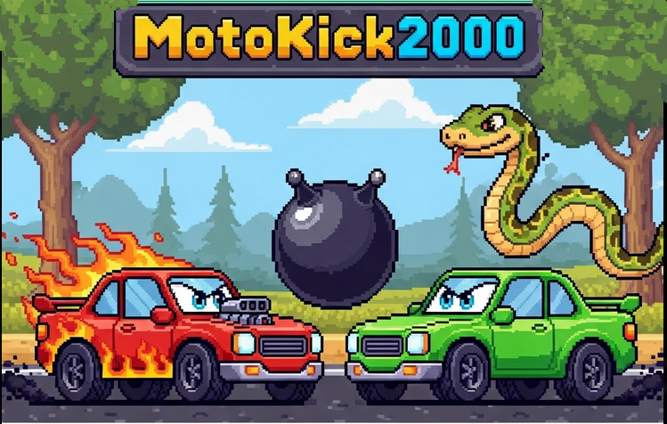

# MotoKick2000 🚗⚽

> **🤖 KI-GENERIERTES SPIEL** - Dieses Spiel wurde vollständig mit KI-gestützter Entwicklung erstellt!

Ein Rocket League-ähnliches Autosoccer-Spiel entwickelt mit **Python**, **Pygame** und **KI-gestützter Entwicklung**.



## 🎮 Über das Spiel

MotoKick2000 ist ein spannendes Autosoccer-Spiel, bei dem du mit einem Auto versuchst, einen Ball ins gegnerische Tor zu schießen. Das Spiel kombiniert realistische Fahrphysik mit strategischem Gameplay und bietet verschiedene Spielmodi.

## ✨ Features

- **Realistische Fahrphysik**: Beschleunigung, Bremsen, Drift und Trägheit
- **KI-Gegner**: Intelligente Computergegner mit verschiedenen Strategien
- **Verschiedene Spielmodi**: 1-4 Spieler (Spieler vs. KI)
- **2-Minuten-Timer**: Spannende, zeitbegrenzte Matches
- **Reifenspuren**: Visuelle Effekte beim Beschleunigen
- **Kollisionssystem**: Realistische Auto-zu-Auto und Auto-zu-Ball Kollisionen
- **Retro-Design**: Ansprechende, pixelartige Grafik

## 🎯 Spielmodi

1. **Spieler 1**: Du gegen die Zeit
2. **Spieler 2**: Du gegen einen KI-Gegner
3. **Spieler 3**: Du gegen zwei KI-Gegner
4. **Spieler 4**: 2v2 Team-Match (Du + KI vs. 2 KI-Gegner)

## 🕹️ Steuerung

- **W**: Gas geben
- **S**: Bremsen/Rückwärts
- **A**: Links lenken
- **D**: Rechts lenken
- **NumPad 0**: Drift
- **Pfeiltasten**: Menünavigation
- **Enter**: Menüauswahl

## 🚀 Installation

### Voraussetzungen
- Python 3.7 oder höher
- Pygame

### Installation
1. Repository klonen:
```bash
git clone https://github.com/yourusername/MotoKick2000_pygame.git
cd MotoKick2000_pygame
```

2. Pygame installieren:
```bash
pip install pygame
```

3. Spiel starten:
```bash
python main.py
```

## 🏗️ Projektstruktur

```
MotoKick2000_pygame/
├── main.py              # Hauptspiellogik
├── auto.py              # Auto-Klasse mit Physik
├── ball.py              # Ball-Physik und -Logik
├── car_ai.py            # KI-Logik für Computergegner
├── tiretrack.py         # Reifenspuren-System
├── goalposts.py         # Torpfosten und -Logik
├── banden.py            # Spielfeld-Banden
├── constants.py         # Spielkonstanten
├── assets/              # Grafiken und Sounds
│   ├── field.png        # Spielfeld
│   ├── car_blue.png     # Blaues Auto
│   ├── car_red.png      # Rotes Auto
│   ├── ball.png         # Ball
│   └── goal.png         # Tor
└── README.md            # Diese Datei
```

## 🤖 KI-Entwicklung

Das Spiel wurde mit **KI-gestützter Entwicklung** erstellt, wobei moderne KI-Tools bei der Programmierung und Optimierung geholfen haben. Die Computergegner verwenden fortschrittliche Algorithmen für:

- **Ballverfolgung**: Intelligente Positionierung hinter dem Ball
- **Torschuss**: Präzise Schüsse auf das gegnerische Tor
- **Defensive**: Blockierung von Gegnertoren
- **Kollisionsvermeidung**: Ausweichen und Unstuck-Mechanismen
- **Teamplay**: Koordination zwischen KI-Teamkollegen

## 🎨 Technische Details

- **Engine**: Pygame
- **Sprache**: Python 3
- **Architektur**: Modulare Klassenstruktur
- **Performance**: Optimierte Kollisionserkennung
- **Physik**: Vektor-basierte Bewegungs- und Kollisionsberechnung

## 🏆 Spielziel

Schieße in 2 Minuten so viele Tore wie möglich! Das Team mit den meisten Toren gewinnt.

## 🤝 Beitragen

Verbesserungsvorschläge und Bug-Reports sind willkommen! Erstelle einfach ein Issue oder einen Pull Request.

## 📄 Lizenz

Dieses Projekt steht unter der MIT-Lizenz.

---

**Entwickelt mit ❤️ und KI-Unterstützung**

*By Superfliege* 